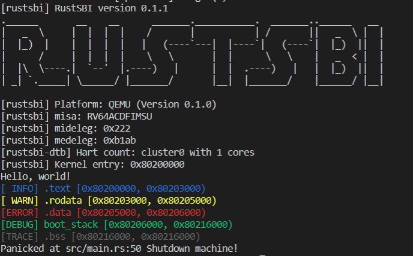

# Report

2018011365 张鹤潇

### 编程作业

在模板代码的基础上，我参考 `rCore` 增加了 `logger` 模块，调用 `log crate` 实现了日志分等级彩色输出的功能。具体而言，我为结构体 `SimpleLogger` 实现了 `Log trait`，并在 `rust_main` 函数中根据 `option_env!("LOG")` 设置日志输出等级，默认输出等级为 `INFO`.

运行 `make run LOG=TRACE`，结果如下：

 

### 问答题

#### 1.

`rustsbi` 启动时打印了 `mideleg` 和 `medeleg` 的值，分别是：

```
[rustsbi] mideleg: 0x222
[rustsbi] medeleg: 0xb1ab
```

可见 S 态时钟中断、S 态外部中断、S 态软件中断被委托给了 OS.

指令未对齐异常、断点异常、U 态系统调用、指令/读/写页缺失、指令/读/写 access fault 异常被委托给了 OS.

#### 2.

进入 qemu 后，pc 的初始值为 `0x1000`，程序在此初始化一些资源，

```assembly
auipc    t0,0x0
addi    a1,t0,32
csrr    a0,mhartid
d    t0,24(t0)	# 即 0x80000000
jr    t0
```

再跳转到 `0x80000000` RustSBI 的 `start` [函数](https://github.com/luojia65/rustsbi/blob/master/platform/qemu/src/main.rs#L93)。

```flow
s=>start: start
o1=>operation: main
o2=>operation: enter_privileged
o3=>operation: s_mode_start
e=>end: 0x80200000

s->o1->o2->o3->e
```
在 `start` 函数和 `main` 函数中经过一系列资源初始化后，程序调整为 S 态，跳转到 `0x80200000` 进入 rCore.

```rust
unsafe {
	mepc::write(s_mode_start as usize);
	mstatus::set_mpp(MPP::Supervisor);
	rustsbi::enter_privileged(mhartid::read(), dtb_pa)	// mret 到 s_mode_start
    // 此后在 s_mode_start 中跳转到 0x80200000
}
```

### 感想

编程作业比较简单，但问答题的探索性质比较强，对我来说还是挺花时间的。