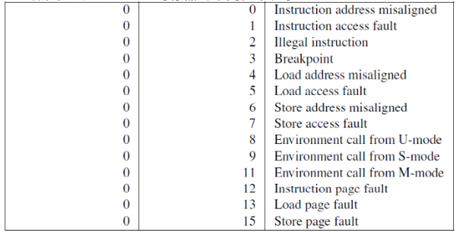
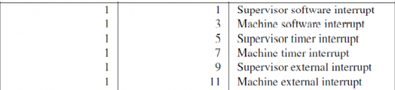

# Report

2018011365 张鹤潇

### 编程作业

我以模板代码为基础，在 `sys_write` 函数中增加了判断被访问地址区域 `[buf, buf+len)` 是否在程序本身的内存空间内，如果该区域既不在用户栈上，也不在`[APP_BASE_ADDRESS, APP_BASE_ADDRESS + APP_LEN)` 中，就打印错误信息并返回 `-1`。

我将 `user` 模块换成了测例仓库，并修改 `os` 模块下的 `build.rs` 和 `Makefile`，使测试能正常进行。

### 简答题

### 1.

测试如下：

1. 使用 S 特权指令 `sret`

   ```bash
   [rustsbi-panic] hart 0 panicked at 'invalid instruction, mepc: 000000008040005c, instruction: 0000000010200073', platform/qemu/src/main.rs:458:17
   ```

2. 访问 S 特权寄存器 `csrr $0, sstatus`

   ```bash
   [rustsbi-panic] hart 0 panicked at 'invalid instruction, mepc: 000000008040005e, instruction: 0000000010002573', platform/qemu/src/main.rs:458:17
   ```

出现这两种错误时，`rustsbi` 会直接 panic 掉，并打印错误指令信息。

#### 2.

1. `a0` 指向将要用来恢复程序上下文的 `TarpContext` .

   `__restore` 的两种使用场景：

   - 初始化用户程序，此时 `a0` 作为函数参数传入
   - 中断/异常/系统调用返回，此时 `a0` 是 `trap_handler` 的返回值。

2. 这六行代码从内核栈上恢复了 `sstatus`, `sepc`, `sscratch`

   - `sstatus` 的 `SPP` 等字段给出 Trap 发生之前 CPU 处在哪个特权级（S/U）等信息；
   - `sepc` 记录 `sret` 后要执行指令的地址；
   - `sscratch` 此时记录了用户栈栈指针的地址。

   这些信息对于内核切换到用户态是必要的。

3. `x2` 是栈指针 `sp`，`x4` 是线程指针 `tp`

   - `sp` 在 `__restore` 起始处由 `a0` 恢复；
   - `tp` 没有使用需求，我们没有在 `__alltraps` 中保存，也不需要在此恢复。

4. 该指令交换了 `sp` 和 `sscratch` 的值，使 `sp` 为用户栈指针，`sscratch` 保存内核栈指针。

5. `sret` 由 S 态返回 U 态，同时将 `pc` 的值设置为 `sepc`. 这是由处理器实现的。

6. 该指令交换了 `sp` 和 `sscratch` 的值，使 `sscratch` 保存用户栈指针，`sp` 为内核栈指针。

7. 从 U 态进入 S 态需要用户程序执行 `ecall`.

### 3.

riscv 支持的异常：



riscv 支持的中断：



通过 cause CSR (mcause/scause) 的 Interrupt 位来判断发生的是中断还是异常；该位为 1 表示中断，为 0 表示异常。

陷入异常时的重要寄存器及其内容：

- mtvec/stvec: 发生异常时要跳转的地址，也是异常处理程序的地址。
- mepc/sepc: 异常发生指令。
- mcause/scause: 异常种类。
- mtval/stval: 异常附加信息。
- mscratch/sstratch: 暂时存放一个字大小的数据。
- mstatus/sstatus: 机器的状态信息。
- mie/sie: 特定中断的使能情况。
- mip/sip: 当前待处理中断。
- mideleg/medeleg: 异常委托寄存器，标记哪些中断/异常被委托给 S 态程序。

### 4.


### 感想

简答题太多了吧，不会做。

编程作业代码量虽小，却需要对程序有充分理解。